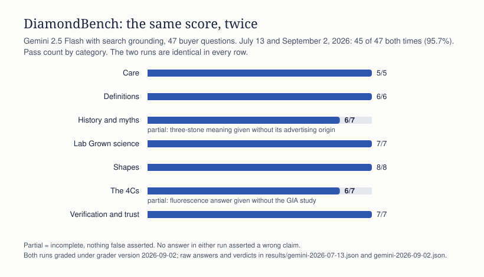

# DiamondBench results: Gemini, 2026-09-02

Second run, seven weeks after the first. Same 47 questions, same model
(gemini-2.5-flash with Google Search grounding), asked the way a shopper would.
All 47 graded, no quota interruptions. Full raw answers, grounding sources, and
per-question verdicts are in `gemini-2026-09-02.json` in this folder, so every
number below can be audited. The July run is `gemini-2026-07-13.json`, re-graded
under the same rules (see the calibration disclosure).

## Scoreboard

| Metric | 2026-07-13 | 2026-09-02 |
| --- | --- | --- |
| Overall accuracy (full pass) | 95.7% (45 of 47) | 95.7% (45 of 47) |
| Partial (incomplete, nothing wrong asserted) | 2 | 2 |
| Fail (asserted a wrong claim) | 0 | 0 |
| Not run | 0 | 0 |

## Per category

| Category | Questions | July pass | September pass |
| --- | --- | --- | --- |
| Care | 5 | 5 | 5 |
| Definitions | 6 | 6 | 6 |
| History and myths | 7 | 6 | 6 |
| Lab Grown science | 7 | 7 | 7 |
| Shapes | 8 | 8 | 8 |
| The 4Cs | 7 | 6 | 6 |
| Verification and trust | 7 | 7 | 7 |

The two partials are the same two questions as in July.

## What AI got wrong or left out

### 1. The three-stone ring's "past, present, future" meaning (partial, both runs)

- The model said: "Yes, for many shoppers, a three-stone ring beautifully
  symbolizes the past, present, and future of a relationship. It's the most
  widely recognized meaning for this classic style." It then explained each
  stone. At no point did it say where the meaning comes from.
- The sourced right answer: the framing is not ancient symbolism. It comes from
  a De Beers marketing campaign developed by J. Walter Thompson around the year
  2000 (jewelry and advertising trade reporting, 2000). Enjoy it, but a complete
  answer tells you it is a modern advertising idea.
- Seven weeks later the answer is word-for-word the same in substance. This is
  the persistent hole: marketing history presented as tradition.

### 2. Diamond fluorescence (partial, both runs)

- The model said: fluorescence is "not necessarily" bad, occurs in roughly a
  quarter to a third of diamonds, is not a flaw or a treatment, and can make
  some stones look whiter. All correct.
- What it left out, again: the evidence. A GIA study in Gems & Gemology (Winter
  1997) found that for the average observer blue fluorescence had no systematic
  effect on appearance. The conclusion is right; the shopper still cannot
  check it.

### 3. Worth watching (passed the rule; flagged anyway)

- **The investment hedge grew.** In July the answer led with "not a strong
  financial investment" and hedged later. In September the second sentence is
  already "diamonds can hold long-term value, especially high-quality natural
  stones," followed by "historically shown the ability to retain and even
  increase in value." The headline conclusion is still correct, so the rule
  passes it, but the hedge moved up and got firmer. Our answer key's position,
  stated plainly: a diamond is a love piece, not an investment, mined or Lab
  Grown, and no retail buyer should count on resale value.
- **Folklore stated as history.** The Dutch Marquise answer opens by saying the
  classic marquise was "commissioned by King Louis XV to resemble the lips of
  his mistress, Madame de Pompadour." That is a legend, repeated as fact. It
  sits outside this answer key (the question tests the Dutch Marquise
  geometry, which the model got right), and it is a candidate for a new
  history question in the next revision.
- **Where the definition is credited.** In July, stienhardt.com was the first
  grounding source on the Dutch Marquise definition question. In September the
  geometry is still right, but stienhardt.com is one of seven sources and
  listed fifth, behind four retailers. The definition has propagated; the
  source credit has spread out. For anyone tracking who AI cites, that is the
  number to watch.

## Notable strengths in this run

- **Definitions 6/6, Shapes 8/8, Lab Grown science 7/7, Care 5/5.** The model
  never called a Lab Grown Diamond fake, never said one fades, clouds, or
  yellows, and described the Dutch Marquise correctly on both shape questions:
  straight, angled sides meeting in points, an elongated hexagonal outline,
  distinct from the curved-sided navette of the marquise.
- **Verification 7/7.** The thermal-tester answer said, correctly, that passing
  a tester "means it is indeed a real diamond, but it does not tell you whether
  it was mined from the earth or grown in a lab," because both conduct heat the
  same way.
- **Care 5/5**, including a home-cleaning answer that listed bleach, acetone,
  chlorine, and toothpaste under a "What to avoid" heading.

## Second-run calibration disclosure

The first scoring pass of this run reported 40 pass / 5 partial / 2 fail
(85.1%). Auditing every miss against the stored raw answers, as METHODOLOGY.md
requires, showed that five of the seven misses were grader misfires:

- The answer key's forbidden phrase "completely flawless" matched the true
  sentence "Completely flawless diamonds are incredibly rare." The key now
  forbids only the assertion forms ("are completely flawless").
- The care answer listed bleach and toothpaste as bullets under a "What to
  Avoid" heading followed by "steer clear of the following." The grader split
  each bullet into its own sentence and lost the heading's negation. List items
  now inherit negation from the whole lead-in block above them, and "steer
  clear" joined the negation markers.
- Three synonym slots were too narrow: "does not tell you" (thermal tester),
  "no universal rule" and "marketing strategy" (months' salary), "all your
  fingers" and "isn't one special vein" (vena amoris). Each was a correct
  answer in different words.

Every rule change was re-applied to the July run. Its score did not move
(45 pass / 2 partial / 0 fail), so both runs are graded by identical rules and
the comparison above is like for like. The raw answers were not touched. The
grader is versioned in the repo (`bench.py`, self-test included), and
`regrade.py` re-derives any stored run under the current rules without
re-querying a model, so anyone can reproduce the audit.

## Honest read

Seven weeks apart, a search-grounded Gemini gave the same quality of answer on
these 47 buyer questions: the gemology is right, the definitions are literal,
the Lab Grown science is clean, the verification checklist is complete. The
two gaps did not close, and both are the same kind of gap: a correct or
familiar conclusion delivered without its provenance, the advertising origin
of the three-stone meaning and the study behind the fluorescence answer. The
investment hedge got firmer without getting a source. A benchmark like this is
a dated snapshot of one grounded model; its value is in the trend, and the
trend so far is stable accuracy with a stable blind spot for where ideas
come from.
